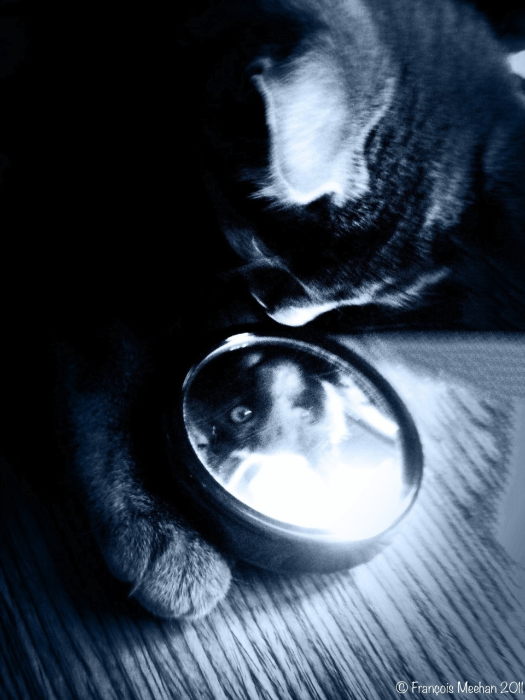
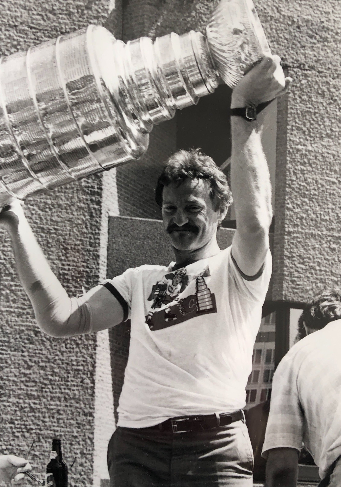
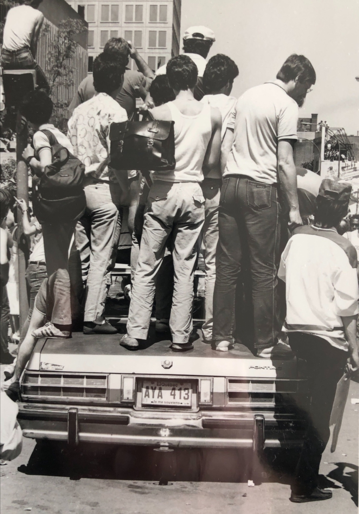
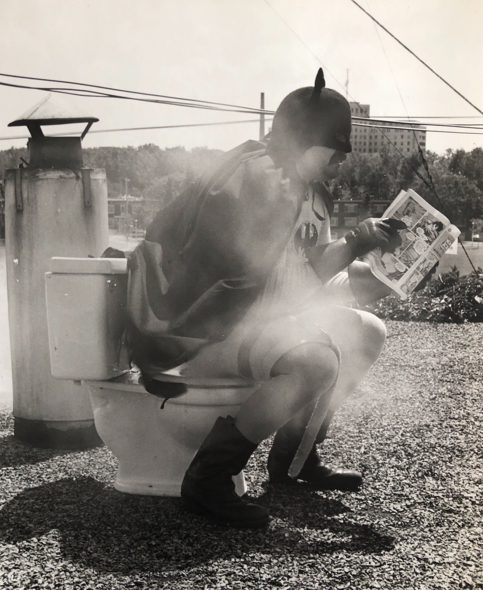

## Un aperçu des articles à venir

Au menu: des photos conçues au fil des jours avec le sympathique duo **iPhone-iPad**!

Nous allons également aborder des thèmes plus conventionnels, tels que la composition et la lumière.

Si vous êtes à la recherche d'idées, d'applications ou d'inspiration, restez branchés pour les prochaines publications.

### Photographie d'animaux 

---

---

### Textures et couleurs

---

---

### Paysages

---

---

### Coupe Stanley de 1986

Présentation d'une mini-série de photos prises lors de la parade de la Coupe Stanley de 1986

---

---

Debout sur le toit d'une voiture qui a dû être *scrapé* par la suite

---

---

### De l'idée à l'image

Comment conceptualiser une idée folle, en image folle

---

---

Amateurs de photographie, ne manquez pas les prochains articles!

