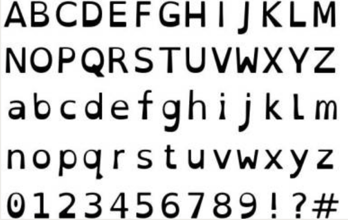

Vous savez, j'adore faire la recherche de techniques, d'applications ou de méthodes susceptibles d'accroître la productivité et la créativité au travail.

Aujourd'hui, je vous propose de faire l'essai d'une nouvelle police de caractères (*font* en anglais).

Habituellement, on fait la sélection d'une police pour améliorer ou harmoniser l'apparence d'un texte.

Cependant, il existe des polices conçues pour une toute autre fin soit celle d’aider la compréhension des messages en format texte et la rétention du contenu, en ciblant tout particulièrement les gens souffrant de [^la_dyslexie].

Vous vous demandez sûrement en quoi la dyslexie pourrait avoir un lien avec la productivité...

En fait, on estime que la [^proportion_des_personnes_atteintes] de dyslexie est d'environ 5% à 10% de la population.

Ces chiffres ne tiennent pas compte du niveau de sévérité et de la variabilité des symptômes, ce qui mène à croire que la proportion élèverait plutôt à 17%.

Pour ne pas avoir rencontré de spécialiste à ce sujet, je ne prétends pas être **officiellement** dyslexique, mais en prenant compte l'effet que la police OpenDyslexic a eu sur moi, je devrais peut-être le faire.

Considérant le grand volume d'informations écrites que je consomme à chaque jour, toute aide à la compréhension et la rétention du contenu est la bienvenue et je suis convaincu que l'usage de OpenDyslexic m'aide en ce sens. 

### OpenDyslexic

Il y a quelques années, en écoutant une baladodiffusion portant sur la productivité au travail, j'ai découvert l'étonnante [^OpenDyslexic], mise au point en 2011 par [^Abbie_Gonzalez].

> Sa motivation: « Créer une police de caractères pour aider les gens atteint de dyslexie qui sera gratuite et disponible à tous.»

Voici OpenDyslexic:

---

---

Avant l'arrivée d'OpenDyslexic, les usagers devaient payer un abonnement annuel pour accéder à ce type de police de caractères spécialisé.

Voici d'autres polices de caractères destinées aux personnes dyslexiques, mais pour lesquelles il faut débourser quelques pécules pour les obtenir:

1. [^Dyslexie] 
2. [^Read_Regular]

Voici la tarification en dollars US de Dyslexie:

|                                        |          |
| -------------------------------------- | -------- |
| Licence pour l'utilisateur à domicile: | \$ 74.93 |
| Éducation:                             | \$119.93 |
| Utilisation commerciale:               | \$134.93 |

OpenDyslexic a été élaborée à partir de la police [^DejaVu].

## Comparaison

Voici un texte avec OpenDyslexic:

Et le même texte, mais avec la police Arial:

Fait surprenant, les deux polices ont la même dimension (12 points).  Bien que le texte en OpenDyslexic semble plus imposant, ce sont les espacements entre les lettres et entre les lignes qui, j'imagine, créent cette impression.

## Usage

Après avoir téléchargé OpenDyslexic et en avoir fait l'installation, vous serez en mesure de la sélectionner dans vos applications.

Vous pouvez aussi l'utiliser et en tant qu'extension sur le fureteur [^Chrome].

Elle est installée sur mon iPad, en utilisant l'application [^Anyfont].

OpenDyslexic est aussi disponible en option sur les tablettes de lecture Kobo Ereader et Amazon Kindle.

OpenDyslexic a fière allure dans un MindMap:

---

---

Les polices suivantes ont aussi des vertus bénéfiques pour contrer la dyslexie:

1. [^Gill_Dyslexic]
1. [^Comic_Sans]
2. [^Sylexiad]

---

> En passant, saviez-vous qu'une police pouvait avoir de la graisse?

---

---

### Des études

Il s'est fait beaucoup d'études sur le sujet, dont celle de Steven L. Powell, intitulé *The impact of [^Specialized_Font] on the Reading Performance of Elementary Children with Reading Disability*

Certaines y notent une amélioration de la compréhension du texte, mais dans l'ensemble, il faut avouer que les évaluations sont très mitigées.

Par contre, si je me fie à mon expérience personnelle, je ressens nettement plus de fluidité dans la lecture et une meilleure concentration lorsque j'utilise OpenDyslexic. C'est ce qui m'amène à vous conseiller d'en faire l'essai, en plus, c'est gratuit!

Pour de plus amples informations (en anglais) je vous suggère de lire cet excellent article du *[^The_Reading_Well]* Dyslexia Font and Style Guide.

À bientôt!

[^la_dyslexie]: Définition de la [La dyslexie](https://psychologie.savoir.fr/dislexie/)
[^proportion_des_personnes_atteintes]: Section [FAQ de l'Uniniversité du Michigan](http://dyslexiahelp.umich.edu/answers/faq)
[^OpenDyslexic]:  Police [OpenDyslexic](https://gumroad.com/l/OpenDyslexic)
[^Abbie_Gonzalez]:  Créateur de OpenDyslexic: [Abbie Gonzalez](https://gumroad.com/antijingoist)
[^DejaVu]: Police [DejaVu](https://en.wikipedia.org/wiki/DejaVu_fonts)
[^Anyfont]: Application [Anyfont](https://apps.apple.com/us/app/anyfont/id821560738)
[^Chrome]: OpenDyslexic [Font for Chrome](https://chrome.google.com/webstore/detail/OpenDyslexic-font-for-chr/cdnapgfjopgaggbmfgbiinmmbdcglnam?hl=en)
[^Dyslexie]: Police [Dyslexie](https://www.dyslexiefont.com/)
[^Read_Regular]: Police [Read Regular](http://www.readregular.com/)  
[^Gill Dyslexic]: Police [Gill Dyslexic](https://florencealbright.wordpress.com/tag/gill-dyslexic/)
[^Comic_Sans]: Police [Comic Sans](https://www.fonts.com/font/microsoft-corporation/comic-sans/regular)
[^Sylexiad]: Police [Sylexiad](https://www.sylexiad.com/)
[^Specialized_Font]: Article The Impact of a [Specialized Font]((https://link.springer.com/article/10.1007/s40688-019-00225-4)) on the Reading Performance of Elementary Children with Reading Disability
[^The_Reading_Well]: Article [Dyslexia Font and Style Guide](https://www.dyslexia-reading-well.com/dyslexia-font.html)
