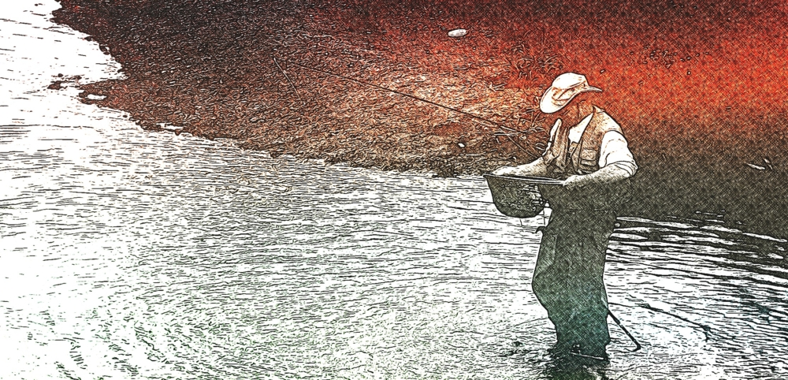

---

## Je me présente: 

Mon nom est François Meehan, je suis:

- Informaticien
- Photographe
- Videographe
- Épicurien
- Pêcheur 

Comment allez-vous?

Si vous êtes en train de lire cette page, cela veut dire que nous avons déjà une chose en commun: la curiosité!

L'informatique m'a offert toute sorte d'opportunités dans des domaines très variés. J'ai fait beaucoup de gestion de projet et j'adore écrire de la documentation, le support à l'usager et l'intégration d'applications en entreprise. 

J'ai accompli des projets dont je suis particulièrement fier, entre autres, d'avoir été publié des dans des revues spécialisées, montées une solution de surveillance réseaux dans le cadre d'une émission de télé-réalité, publié le code source de 2 intégrations que j'ai mises au point, celle de trappes [^SNMP] dans Nagios et celle de Nagios-RT (Request Tracker), qui a été utilisé par American Airlines.

Mais j'ai aussi un côté artistique, la créativité, je suis tombé dedans. 

Et j'utilise celle-ci pour la création de matériel audio visuel, la photographie, la production de vidéo et la composition de trame musicale 

### Projets courants

Voici quelques projets sur lesquelles je travaille présentement.

#### Produire du matériel audio visuel sur IOS

Je suis un grand admirateur des appareils iPhone et iPad pour la création et montage de vidéos, la photographie, la composition de trame musicale, composition de billet de blogue et j'en passe.

Ayant fait l'acquisition de plus de 1,100 applications sous IOS, je me suis monté une combinaison de logiciels ultra-performants, bien plus abordable que leurs équivalences pour Windows et Mac OSX.

Concept: 

> Donner des ateliers en entreprise sur la façon d'utiliser iPhone et iPad pour produire du matériel pour leur site WEB, des articles de promotion, des vidéos de formations, etc.

 
 

#### Gatsby JS -- GraphQL -- MDX

- Adapter [^Gatsby] JS, un générateur de sites Web statiques, pour diverses _saveurs_ de site WEB
- Approfondir les fonctionnalités taxonomiques de Gatsby JS pour fin de gestion documentaire
- Convertir ma documentation technique à MDX

 
 

#### Gestion de projet Kanban

- Promotion, solutions de gestion de projets agile en milieu manufacturier en utilisant [^Wekan] (Vivify, Trello)

 
 

### IOT et automatisation de processus

- Tests du protocole MQTT avec Node Red et/ou Huginn en tant que *hub* de communications, pour fin de géolocalisation dans un contexte IOT
- Intégrer les Webhooks de Wekan pour les présenter en format RSS

 
 

### Statut

**je suis à la recherche d'opportunités informatique**

Vous avez besoin d'un informaticien polyvalent? 

Voici mon C.V.:   <a href="https://drive.google.com/uc?id=16y-bQ1HMp3tR_oCH6I-ubaB5vdgbTKHY" target="_blank">François Meehan C.V.</a>

---

## Photographie artistique

La photo occupe une très grande place dans ma vie et elle m'a fait vivre toutes sortes d'expériences du fait que j'expérimente constamment de nouvelles techniques, de nouvelles approches. 

Je suis fier d'avoir eu plus de 1,2 million de visites sur mon site [^Flickr], vu mes oeuvres exposer au Musée d’art contemporain de Montréal, monté des tablettes digitales pour des expositions muséales qui sont maintenant dotées de fonctions, par exemple *le mode portrait* qui n'a pas d'équivalence chez les caméras digitales conventionnelles.

Depuis 3 ans environ, j'utilise strictement que mon iPhone et mon iPad pour faire de la photos. 

**Vous êtes à la recherche d'un photographe voyant les choses d'un autre oeil, possédant un regard vraiment différent?**

Voici un aperçu de ma photographie:  <a href="https://www.flickr.com/photos/12149783@N04/" target="_blank">Mes photos sur Flickr</a>

---

## La pêche, la cuisine et autre méfaits

Selon mon épouse, je suis un adepte de la cuisine _chaotique_, pouvant transformer une cuisine en ordre, en incroyable cafouillis le temps de le dire. 

Avec le temps, j'ai mis au point et documenté toute sorte de  recettes: de la frite au four au caramel salé, en passant par les sauces, les vinaigrettes...

Des recettes simples, mais avec des petits trucs de mon cru que je vais bientôt partager avec vous.  

Également au menu, des histoires de pêche, des Espritdebottines et autres anectotes.

Je vous remercie de votre visite,
 
 

*François*

[^SNMP]: Article dans la revue [SysAdmin](https://www.drdobbs.com/snmp-trap-handling-with-nagios/199102017)
[^Gatsby]: [Gatsby](https://www.gatsbyjs.org/) générateur de site WEB statique 
[^Wekan]: [Wekan](https://www.gatsbyjs.org/) Wekan gestion de projet Kanban
[^Flickr]: [Stats](https://www.flickr.com/photos/12149783@N04/stats) de visites sur Flickr

<AuthorBanner></AuthorBanner>